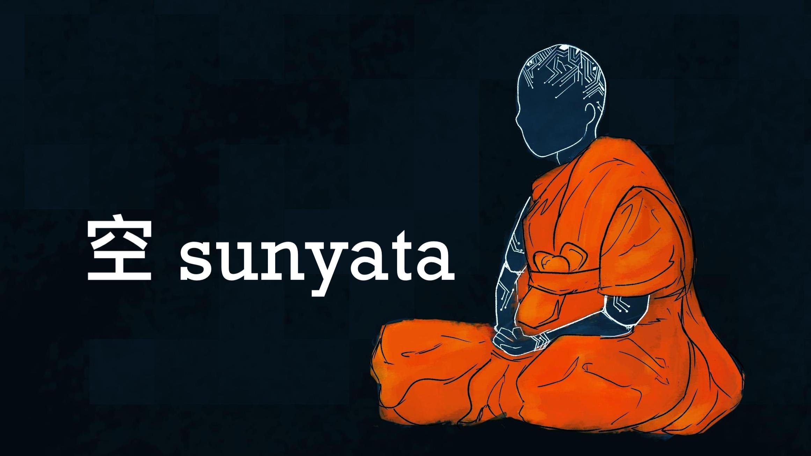

sunyata
=======

`sunyata` is a blockchain skeleton. It implements a minimally-functional
proof-of-work blockchain, including consensus algorithms, p2p networking, a
transaction pool, a wallet, and a simple miner. "Minimally-functional" means
that `sunyata` only supports one transaction type: sending X coins to address Y.
There is no scripting system or multisig support; all addresses are pubkey
hashes.

But `sunyata` *does* implement one feature that no other blockchain does: a UTXO
accumulator, namely Tadge Dryja's [Utreexo](https://eprint.iacr.org/2019/611).
This accumulator replaces the traditional UTXO database with a Merkle forest;
instead of checking for a UTXO's existence within a database, nodes verify a
*proof* of the UTXO's existence (provided in the transaction) against the
accumulator. The accumulator itself is tiny -- about 1 KB -- and grows
logarithmically with the number of unspent outputs, whereas a database grows
linearly.

This design has a number of benefits for performance, scalability, and
functionality, making it vastly easier to run a fully-validating node. A new
user can start validating new blocks almost instantly: all they need is a copy
of the latest accumulator state. Initial block download can be performed in
parallel by using multiple accumulator states at checkpoints throughout the
chain. And since no costly database operations are required to process incoming
blocks, you can sync almost as fast as your disk's write speed.

`sunyata` is not a cryptocurrency; it's just the skeleton of one. The goal is
provide a simple, performant, and robust foundation on which future
cryptocurrencies can be built. Accordingly, its design is fairly "conservative"
aside from the accumulator; in other words, it cribs heavily from Bitcoin. ;)
